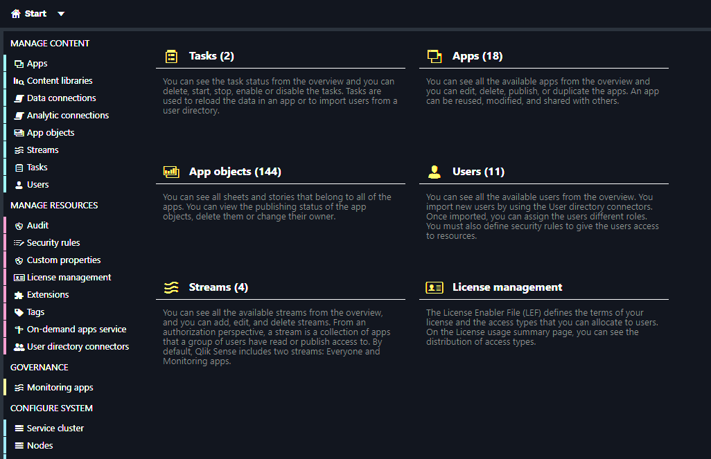
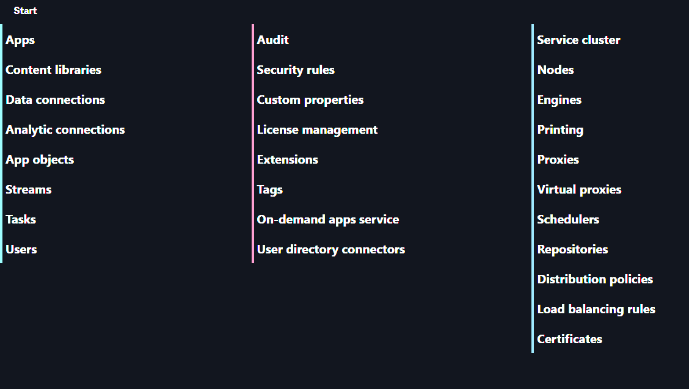

# Dark and/or minimal view for Qlik related products

Its annoying to have the bright QMC view when opening it in the night hours :)

Not everything is perfect but it will get better when find the time. Feel free to contribute if You are interested!

---

Using [Stylus](https://chrome.google.com/webstore/detail/stylus/clngdbkpkpeebahjckkjfobafhncgmne) browser extension (available for Chrome, Firefox and Opera) and added the `css` files from this repo.

- (QSEoW QMC) Applied only the dark theme (main page)
  

- (QSEoW QMC) Applied only the dark theme (extensions page)
  

- (QSEoW QMC) Applied the dark and minimal themes (main page)
  

- Applied the `qlik-community.css` to [https://community.qlik.com](https://community.qlik.com)

  > **Note**
  > Style can be installed from [userstyles.world](https://userstyles.world/style/6686/qlik-community-dark-theme)

  

## Apply to a specific domain(s)

[Stylus](https://chrome.google.com/webstore/detail/stylus/clngdbkpkpeebahjckkjfobafhncgmne) allows applying the styles only to a specific domain(s). If no domain is specified the styles will be applied to every visited website.

- Open the extension and press `Manage`

  

- Create new style

  

- Give the style a name and paste the css

  

- At the bottom press `+` to add domain

  

- Choose `URLs on the domain` and add the domain name (the example below is for Qlik Community)

  

- Press `Save`

  

- Thats it! Now every time community.qlik.com is visited the style will be applied
